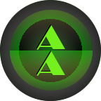
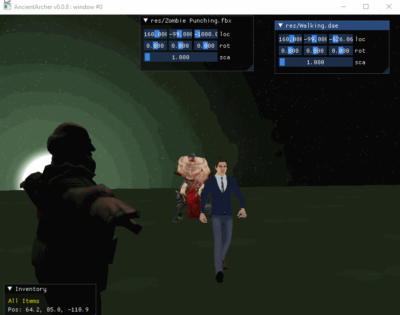

# AncientArcher

Ancient Archer is an C++ library front end to open source tools and my custom configs to make coding up a game or simulation from *scratch* a little easier. 

### [Public Space Docs Webpage](https://mattearly.github.io/AncientArcher/index.html)



Context Handled: 
 - OpenGL Renderering
 - Model & Texture Loaders with optimized resource management 
 - Point, Directional, and Spot Lights
 - Spacial Transformations
 - Function Based Client Core Loop
 - Skeletal Animations (testing)
 - Physics (testing)
 - Input Controls
 - Windowing
 - Cameras
 - GLSL Shaders
 - Cubemap Skyboxes
 - 3D Sound

### Compile

Recommended: 
 - OS: Windows 10.
 - IDE: MSVC16, x64. Visual Studio 2019 Community Edition.

*While AncientArcher code is generally designed to be crossplatform, at this stage the build system is handled via Visual Studio Solution file. Converting it to CMake will be done at some point. If you are just using some of the code and not the whole project it should work the same on any OS.*

### Dependencies

glm, assimp, glfw3, glad, OpenAL-Soft, sndfile, imgui

*managed by vcpkg manifest*

### Tests and Samples

- CoreTests: base case tests 
- ExampleProject: fpp with walk controls (WASD), and (TAB) to gain mouse control for sample menu/inventory. Sample models are form mixamo.com

Link AAEngine to your project and add the headers (/include/), and then you can begin using it in your code.

### Sample usage code

```cpp
#include <AncientArcher/AncientArcher.h>

AA::AncientArcher instance;

int main(int argc, char** argv) {
  instance.Init();
  /* 
   your code here -> implement camera, lights, models, sounds, 
   input handling, and their logic at will 
  */
  // instance.Add...
  return instance.Run();
}
```

### Future Development

*No longer maintained - future development (AncientArcher2) has moved to a private space, where access is given to supporters.*

still on the todo list:
- Vulkan renderer
- Shadow mappings
- HDR lighting
- PBR workflow
- Proper physics implementation
- Sound improvements
- Multi instance runtime
- and more...
